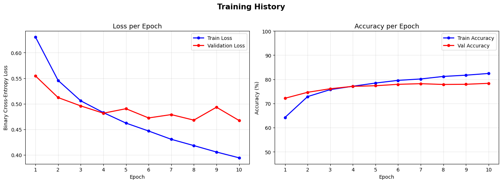

# Sentiment Analysis with Custom LSTM

A deep learning project that implements a complete Twitter sentiment analysis pipeline using a **custom LSTM cell built from first principles** — no `nn.LSTMCell`, just raw tensor operations. Every component of the pipeline is hand-crafted: the LSTM gate equations, tokenizer, vocabulary builder, padding, and evaluation loop.



---

## Table of Contents

- [Overview](#overview)
- [Features](#features)
- [Project Structure](#project-structure)
- [Model Architecture](#model-architecture)
- [Dataset](#dataset)
- [Installation](#installation)
- [Running the Demo](#running-the-demo)
- [Running the Full Pipeline](#running-the-full-pipeline)
- [Results](#results)
- [Key Design Decisions](#key-design-decisions)
- [Report](#report)
- [License](#license)

---

## Overview

This project tackles binary sentiment classification on the **Sentiment140** dataset (1.6 million tweets). The central goal is not just to achieve good accuracy, but to demonstrate a **deep understanding of LSTM internals** by:

- Implementing the four LSTM gates (`i`, `f`, `g`, `o`) using only `torch.matmul`, `torch.sigmoid`, and `torch.tanh`
- Proving correctness by copying PyTorch's official `nn.LSTMCell` weights and verifying outputs match within `1e-5`
- Building the full NLP pipeline without high-level abstractions: custom regex cleaning, whitespace tokenization, frequency-based vocabulary, right-padding, and stratified splitting

**Final test accuracy: 79.18% | F1-score: 0.79**

---

## Features

- Custom LSTM cell implemented from scratch using raw PyTorch tensor operations
- Numerical equivalence verification against PyTorch's built-in `nn.LSTMCell`
- Full preprocessing pipeline: URL/mention/hashtag cleaning, tokenization, vocabulary, encoding, padding
- Stratified 60/20/20 train/val/test split with data-leakage prevention (vocabulary built on train only)
- Learning rate scheduling (`ReduceLROnPlateau`) and gradient clipping (`max_norm=1.0`)
- Interactive demo for live tweet prediction
- Complete Jupyter notebook (Google Colab compatible)
- Academic-style LaTeX report with training curves and confusion matrix

---

## Project Structure

```
DL Project/
├── dataset/
│   └── training.1600000.processed.noemoticon.csv    # Sentiment140 (1.6M tweets, 220 MB)
├── project report.pdf                               # Full academic report
├── training_curves.png                              # Loss & accuracy plots
├── custom_lstm_cell.py                              # CustomLSTMCell + SentimentLSTM model
├── preprocess.py                                    # Cleaning, tokenization, vocab, encoding
├── data_pipeline.py                                 # End-to-end: CSV → DataLoaders
├── compare_lstm.py                                  # Verify custom cell vs nn.LSTMCell
├── demo.py                                          # Quick training + interactive predictions
├── create_notebook.py                               # Generates the .ipynb programmatically
└── Sentiment_Analysis_RNN_LSTM.ipynb               # Full Colab notebook
```

---

## Model Architecture

```
Input: token IDs  [batch, seq_len=30]
         │
         ▼
  nn.Embedding(vocab_size, embed_dim=64, padding_idx=0)
         │
         ▼  [batch, 30, 64]
  Dropout(p=0.3)
         │
         ▼
  CustomLSTMCell  (unrolled over 30 timesteps)
  ┌─────────────────────────────────────────┐
  │  input_size=64, hidden_size=128         │
  │                                         │
  │  i_t = σ(x_t·Wᵢᵢᵀ + h_{t-1}·Wₕᵢᵀ + b) │
  │  f_t = σ(x_t·Wᵢ_fᵀ + h_{t-1}·Wₕ_fᵀ + b)│
  │  g_t = tanh(x_t·Wᵢ_gᵀ + h_{t-1}·Wₕ_gᵀ + b)│
  │  o_t = σ(x_t·Wᵢ_oᵀ + h_{t-1}·Wₕ_oᵀ + b)│
  │  c_t = f_t ⊙ c_{t-1} + i_t ⊙ g_t      │
  │  h_t = o_t ⊙ tanh(c_t)                 │
  └─────────────────────────────────────────┘
         │  final h_T  [batch, 128]
         ▼
  Dropout(p=0.3)
         │
         ▼
  nn.Linear(128 → 1)
         │
         ▼
  BCEWithLogitsLoss  →  binary prediction (positive / negative)
```

**Total trainable parameters:** ~1.7 million

---

## Dataset

**Sentiment140** — collected via the Twitter API in 2009.

| Property | Value |
|---|---|
| Total tweets | 1,600,000 |
| Labels | 0 = Negative, 4 = Positive (50/50) |
| Used subsample | 100,000 tweets (50k per class) |
| Max sequence length | 30 tokens (covers 99.6% of tweets) |
| Vocabulary size | ~11,000–15,000 words (min freq = 2) |

**Download the dataset from Kaggle:**

```bash
pip install kaggle
# Place your kaggle.json API token at ~/.kaggle/kaggle.json
kaggle datasets download -d kazanova/sentiment140
unzip sentiment140.zip -d dataset/
```

Or download manually from [Kaggle — Sentiment140](https://www.kaggle.com/datasets/kazanova/sentiment140) and place the CSV inside the `dataset/` folder.

---

## Installation

**Requirements:** Python 3.8+

```bash
# Clone the repository
git clone https://github.com/Haiqa461/sentiment-lstm-from-scratch.git
cd sentiment-lstm-from-scratch

# Install dependencies
pip install torch numpy pandas scikit-learn matplotlib seaborn
```

**GPU (recommended):** The code auto-detects CUDA. Install PyTorch with CUDA support from [pytorch.org](https://pytorch.org/get-started/locally/) for faster training. CPU works fine for the demo.

---

## Running the Demo

The fastest way to see the project in action — trains on 20,000 tweets for 5 epochs, then opens an **interactive prompt** where you can type any tweet and get an instant sentiment prediction.

```bash
python demo.py
```

**Expected output:**

```
Device: cuda
Loading and preprocessing 20,000 tweets...
Epoch 1/5 | Loss: 0.6124 | Train Acc: 63.4% | Val Acc: 70.1%
Epoch 2/5 | Loss: 0.5381 | Train Acc: 72.8% | Val Acc: 73.5%
...
Epoch 5/5 | Loss: 0.4702 | Train Acc: 78.2% | Val Acc: 76.9%

--- Sample Predictions ---
"I love this movie!"            → POSITIVE (0.91)
"Terrible experience today"     → NEGATIVE (0.08)

--- Interactive Mode ---
Enter a tweet (or 'quit' to exit): I just got promoted!
→ POSITIVE (confidence: 0.88)

Enter a tweet (or 'quit' to exit):
```

---

## Running the Full Pipeline

### Option 1: Jupyter Notebook (Recommended for learning)

Open `Sentiment_Analysis_RNN_LSTM.ipynb` in **Google Colab** or a local Jupyter server. The notebook walks through every step with explanations, code, and inline visualizations.

```bash
# Local Jupyter
pip install jupyter
jupyter notebook Sentiment_Analysis_RNN_LSTM.ipynb
```

Or upload directly to [Google Colab](https://colab.research.google.com/) for free GPU access.

### Option 2: Python Scripts

**Step 1 — Verify the custom LSTM cell is numerically correct:**

```bash
python compare_lstm.py
```

Copies weights from `nn.LSTMCell` into `CustomLSTMCell` and asserts outputs match within `1e-5`. You should see:

```
Max absolute difference: 3.8e-07
✓ CustomLSTMCell matches nn.LSTMCell output within tolerance.
```

**Step 2 — Run the full data pipeline:**

```bash
python data_pipeline.py
```

Loads the CSV, cleans tweets, builds vocabulary, encodes sequences, and creates PyTorch `DataLoader` objects for train/val/test.

**Step 3 — Explore preprocessing utilities:**

```bash
python preprocess.py
```

Demonstrates the regex cleaning, tokenization, and vocabulary building on a small sample.

---

## Training Details

| Hyperparameter | Value |
|---|---|
| Epochs | 10 |
| Batch size | 128 |
| Optimizer | Adam |
| Learning rate | 1e-3 |
| LR scheduler | ReduceLROnPlateau (patience=2, factor=0.5) |
| Gradient clipping | max\_norm = 1.0 |
| Dropout | 0.3 (after embedding + before linear) |
| Embedding dim | 64 |
| Hidden size | 128 |
| Loss function | BCEWithLogitsLoss |
| Random seed | 42 |

---

## Results

**Test set performance (100k tweets, 20% held-out):**

| Metric | Score |
|---|---|
| Accuracy | **79.18%** |
| Precision | 0.79 |
| Recall | 0.79 |
| F1-score | **0.79** |


The model shows balanced performance across both classes with no significant bias toward positive or negative sentiment.

---

## Key Design Decisions

**Why implement LSTM from scratch?**
Using `nn.LSTMCell` would achieve the same accuracy in fewer lines, but the goal is to prove understanding of the gate equations, cell state update, and gradient flow — not to maximize accuracy with black-box components.

**Why build vocabulary only on training data?**
If val/test tokens were included, their word frequencies could influence which words enter the vocabulary, leaking information from future data into the training process. The split happens *before* vocabulary construction.

**Why stratified splits?**
Without `stratify=labels`, a random 80/20 split of a 50/50 dataset can still produce imbalanced subsets by chance, silently biasing accuracy metrics.

**Why gradient clipping?**
LSTMs on long sequences can produce large gradient norms during early training. Clipping at `max_norm=1.0` prevents weight updates from becoming destructively large.

**Why `BCEWithLogitsLoss` over `sigmoid` + `BCELoss`?**
The fused version is numerically stable for large logits where `sigmoid` saturates to exactly 0 or 1, causing `log(0)` = `-inf` in the loss computation.

---

## Report

A full academic-style report is available in [report/report.pdf](report/report.pdf), covering:

- Theoretical background on RNNs and the vanishing gradient problem
- LSTM gate equations and cell state mechanics
- Preprocessing decisions and their justification
- Training curves, ablation discussion, and test set evaluation
- Comparison with PyTorch's built-in implementation

---

## License

This project is released under the [MIT License](LICENSE). Feel free to use, adapt, and build on it for educational or research purposes.

---

*Built with PyTorch · Trained on Sentiment140 · Implemented from scratch for learning purposes*
